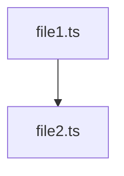

# Import Graph Analyzer - Quick Start

## Installation

No installation needed - already integrated into krolik-cli parsers.

## Basic Usage

```typescript
import {
  buildImportGraphSwc,
  formatImportGraphAscii,
  filterGraphByPatterns,
  getGraphStats,
} from '@/commands/context/parsers';

// 1. Build graph
const graph = buildImportGraphSwc('src/features/booking', ['booking']);

// 2. Format as ASCII
console.log(formatImportGraphAscii(graph));

// 3. Get statistics
const stats = getGraphStats(graph);
console.log(`Files: ${stats.totalFiles}, Circular: ${stats.circularDependencies}`);
```

## Common Patterns

### Analyze a Feature
```typescript
const graph = buildImportGraphSwc('src/features/booking', ['booking']);
console.log(formatImportGraphAscii(graph, { maxDepth: 2 }));
```

### Find Circular Dependencies
```typescript
const graph = buildImportGraphSwc('src', []);
if (graph.circular.length > 0) {
  console.log('🔴 Circular dependencies found:');
  graph.circular.forEach(cycle => {
    console.log(`  ${cycle.join(' → ')}`);
  });
}
```

### Get Most Imported File
```typescript
const stats = getGraphStats(graph);
console.log(`Most imported: ${stats.mostImported.file} (${stats.mostImported.count} imports)`);
```

### Generate Mermaid Diagram
```typescript
const mermaid = formatImportGraphAscii(graph, { mermaid: true });
console.log(mermaid);
// Copy output to Markdown or Mermaid Live Editor
```

### Filter by Pattern
```typescript
// All files - full graph
const fullGraph = buildImportGraphSwc('src/features', []);

// Only booking-related files
const bookingGraph = filterGraphByPatterns(fullGraph, ['booking']);

// Multiple patterns
const paymentGraph = filterGraphByPatterns(fullGraph, ['booking', 'payment']);
```

### Format with Options
```typescript
// Deep tree with import counts
console.log(formatImportGraphAscii(graph, {
  maxDepth: 5,
  showImportedBy: true
}));

// Shallow tree
console.log(formatImportGraphAscii(graph, {
  maxDepth: 1
}));

// Mermaid
console.log(formatImportGraphAscii(graph, {
  mermaid: true
}));
```

## Integration Examples

### Add to Context XML
```typescript
import { buildImportGraphSwc, getGraphStats } from '@/commands/context/parsers';

function addImportGraphToContext(featureDir: string, featureName: string): string {
  const graph = buildImportGraphSwc(featureDir, [featureName]);
  const stats = getGraphStats(graph);

  let xml = '<imports>\n';
  xml += `  <total-files>${stats.totalFiles}</total-files>\n`;
  xml += `  <circular-dependencies>${stats.circularDependencies}</circular-dependencies>\n`;

  if (graph.circular.length > 0) {
    xml += '  <circular>\n';
    graph.circular.forEach(cycle => {
      xml += `    <cycle>${cycle.join(' → ')}</cycle>\n`;
    });
    xml += '  </circular>\n';
  }

  xml += '</imports>\n';
  return xml;
}
```

### Detect Cross-Feature Dependencies
```typescript
function checkFeatureIsolation(featureDir: string, featureName: string): boolean {
  const graph = buildImportGraphSwc(featureDir, [featureName]);

  const hasExternalDeps = graph.nodes.some(node =>
    node.imports.some(imp => !imp.includes(featureName))
  );

  if (hasExternalDeps) {
    console.log(`⚠️  ${featureName} has external dependencies`);
    return false;
  }

  console.log(`✅ ${featureName} is isolated`);
  return true;
}
```

### Find Refactoring Candidates
```typescript
function findRefactoringCandidates(dir: string): void {
  const graph = buildImportGraphSwc(dir, []);
  const stats = getGraphStats(graph);

  console.log('Refactoring candidates:');
  console.log(`  Most imported: ${stats.mostImported.file} (${stats.mostImported.count})`);
  console.log(`  Most imports: ${stats.maxImports.file} (${stats.maxImports.count})`);

  // Files with many imports might need splitting
  const busyFiles = graph.nodes
    .filter(n => n.imports.length > 5)
    .sort((a, b) => b.imports.length - a.imports.length);

  console.log('\nFiles with many imports (consider splitting):');
  busyFiles.forEach(node => {
    console.log(`  ${node.file} (${node.imports.length} imports)`);
  });
}
```

## API Reference

| Function | Purpose | Returns |
|----------|---------|---------|
| `buildImportGraphSwc(dir, patterns)` | Build dependency graph | `ImportGraph` |
| `formatImportGraphAscii(graph, opts)` | Format as ASCII/Mermaid | `string` |
| `filterGraphByPatterns(graph, patterns)` | Filter by patterns | `ImportGraph` |
| `getGraphStats(graph)` | Calculate statistics | `Statistics` |

## Output Formats

### ASCII Tree
```
Import Graph
============================================================
Total files: 11
Circular dependencies: 0

Dependency Tree:
• components-swc.ts (imports: 1)
     • types.ts (imported by: 6)
```

### Mermaid


## Tips

1. **Start broad, then filter**: Build full graph, then filter by pattern
2. **Check circular first**: Always check `graph.circular.length`
3. **Use maxDepth**: Limit tree depth for large codebases
4. **Mermaid for docs**: Use mermaid output for documentation
5. **Pattern matching**: Case-insensitive substring match

## Troubleshooting

### No files found
- Check `dir` exists
- Verify patterns match file names (case-insensitive)
- Only `.ts` and `.tsx` files are analyzed

### Missing imports
- Only local imports tracked (`./`, `@/`, `~/`)
- Node modules ignored
- Dynamic imports not supported

### Circular dependencies
- Not always bad (type-only cycles are fine)
- Use Mermaid to visualize
- Check if breaking cycle would improve architecture

## Next Steps

1. Read full documentation: `IMPORT-GRAPH.md`
2. See integration examples: `EXAMPLE-import-graph-integration.ts`
3. Check implementation: `src/commands/context/parsers/import-graph-swc.ts`
