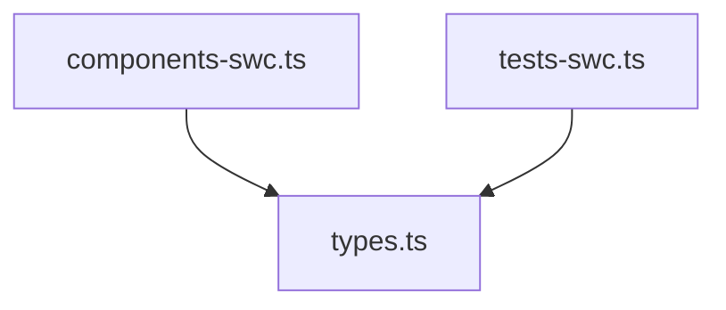

# Import Graph Analyzer (SWC-based)

> Fast dependency graph analyzer using SWC AST parsing

## Overview

The `import-graph-swc.ts` module provides comprehensive import dependency analysis using SWC's fast Rust-based parser. It builds a complete dependency graph, detects circular dependencies, and provides multiple visualization formats.

## Features

- **Fast SWC parsing**: Leverages existing `@/lib/@swc` infrastructure
- **Accurate AST-based analysis**: No false positives from strings/comments
- **Alias support**: Handles `@/`, `~/`, and relative imports (`./`, `../`)
- **Circular dependency detection**: Uses depth-first search to find cycles
- **Multiple output formats**: ASCII tree and Mermaid diagrams
- **Pattern filtering**: Focus on specific features/domains
- **Comprehensive statistics**: Import counts, most-imported files, etc.

## API

### Core Functions

#### `buildImportGraphSwc(dir: string, patterns: string[]): ImportGraph`

Build a complete import dependency graph.

**Parameters:**
- `dir`: Root directory to analyze
- `patterns`: File name patterns to filter (empty array = all files)

**Returns:** `ImportGraph` with nodes and circular dependency chains

**Example:**
```typescript
import { buildImportGraphSwc } from '@/commands/context/parsers';

const graph = buildImportGraphSwc('src/features/booking', ['booking']);
console.log(`Found ${graph.nodes.length} files`);
console.log(`Circular dependencies: ${graph.circular.length}`);
```

#### `formatImportGraphAscii(graph: ImportGraph, options?): string`

Format graph as ASCII tree or Mermaid diagram.

**Options:**
- `maxDepth?: number` - Maximum tree depth (default: 3)
- `showImportedBy?: boolean` - Show import counts (default: false)
- `mermaid?: boolean` - Output Mermaid diagram (default: false)

**Example:**
```typescript
// ASCII tree
console.log(formatImportGraphAscii(graph, {
  maxDepth: 2,
  showImportedBy: true
}));

// Mermaid diagram
console.log(formatImportGraphAscii(graph, { mermaid: true }));
```

#### `filterGraphByPatterns(graph: ImportGraph, patterns: string[]): ImportGraph`

Filter graph to include only files matching patterns and their dependencies.

**Example:**
```typescript
const bookingGraph = filterGraphByPatterns(graph, ['booking', 'payment']);
```

#### `getGraphStats(graph: ImportGraph): GraphStatistics`

Calculate statistics about the import graph.

**Returns:**
- `totalFiles`: Number of files in graph
- `totalImports`: Total number of import statements
- `circularDependencies`: Number of circular dependency chains
- `avgImportsPerFile`: Average imports per file
- `maxImports`: File with most imports
- `mostImported`: Most frequently imported file

**Example:**
```typescript
const stats = getGraphStats(graph);
console.log(`Average imports per file: ${stats.avgImportsPerFile.toFixed(2)}`);
console.log(`Most imported: ${stats.mostImported.file}`);
```

## Data Structures

### ImportGraph

```typescript
interface ImportGraph {
  nodes: ImportNode[];
  circular: string[][]; // Circular dependency chains
}
```

### ImportNode

```typescript
interface ImportNode {
  file: string;          // Relative path from root
  imports: string[];     // Files this node imports
  importedBy: string[];  // Files that import this node
}
```

## Output Examples

### ASCII Tree

```
Import Graph
============================================================
Total files: 11
Circular dependencies: 0

Dependency Tree:
• components-swc.ts (imports: 1)
     • types.ts (imported by: 6)
• tests-swc.ts (imports: 1)
     ↻ types.ts (imported by: 6)
• zod-swc.ts (imports: 1)
     ↻ types.ts (imported by: 6)
```

**Legend:**
- `•` - First occurrence of a file
- `↻` - Already visited (prevents infinite recursion)
- `(imports: N)` - Number of files this imports
- `(imported by: N)` - Number of files importing this

### Mermaid Diagram



## Use Cases

### 1. Feature Context Analysis

Generate import graph for a specific feature:

```typescript
const graph = buildImportGraphSwc('src/features', ['booking']);
const ascii = formatImportGraphAscii(graph, { maxDepth: 3 });
console.log(ascii);
```

### 2. Circular Dependency Detection

Find and report circular dependencies:

```typescript
const graph = buildImportGraphSwc('src', []);
if (graph.circular.length > 0) {
  console.log('Circular dependencies found:');
  for (const cycle of graph.circular) {
    console.log(`  ${cycle.join(' → ')}`);
  }
}
```

### 3. Dependency Analysis

Find most-imported files (potential refactoring candidates):

```typescript
const stats = getGraphStats(graph);
console.log(`Most imported: ${stats.mostImported.file}`);
console.log(`Import count: ${stats.mostImported.count}`);
```

### 4. Feature Isolation Check

Verify a feature doesn't depend on another:

```typescript
const bookingGraph = buildImportGraphSwc('src/features/booking', []);
const hasPaymentDeps = bookingGraph.nodes.some(node =>
  node.imports.some(imp => imp.includes('payment'))
);
if (hasPaymentDeps) {
  console.log('WARNING: Booking depends on Payment feature');
}
```

## Integration with Context Command

Add to context XML output:

```typescript
import { buildImportGraphSwc, formatImportGraphAscii } from '@/commands/context/parsers';

const graph = buildImportGraphSwc(featureDir, [featureName]);
const ascii = formatImportGraphAscii(graph, { maxDepth: 2 });

xml += `
<imports>
  <summary>
    Total files: ${graph.nodes.length}
    Circular dependencies: ${graph.circular.length}
  </summary>
  <graph>
${ascii}
  </graph>
</imports>
`;
```

## Performance

- **Fast parsing**: Uses SWC's Rust parser (~10-20x faster than TypeScript compiler)
- **Caching**: Leverages `@/lib/@swc` parse cache for repeated file access
- **Efficient DFS**: Circular dependency detection uses optimized depth-first search

## Limitations

1. **Local imports only**: Only tracks relative (`./`, `../`) and alias (`@/`, `~/`) imports
2. **No dynamic imports**: `import()` expressions not analyzed
3. **File resolution**: Uses simple extension matching (`.ts`, `.tsx`, `/index.ts`)
4. **Pattern matching**: Simple substring match (case-insensitive)

## Future Enhancements

- [ ] Dynamic import support (`import()`)
- [ ] Module boundary detection
- [ ] Import cost calculation (LOC, dependencies)
- [ ] Export usage tracking
- [ ] Bundle analysis integration
- [ ] GraphQL/tRPC endpoint mapping

## See Also

- `/src/lib/@swc/` - SWC AST infrastructure
- `/src/commands/context/parsers/types-parser-swc.ts` - Type extraction
- `/src/commands/context/parsers/zod-swc.ts` - Schema parsing
